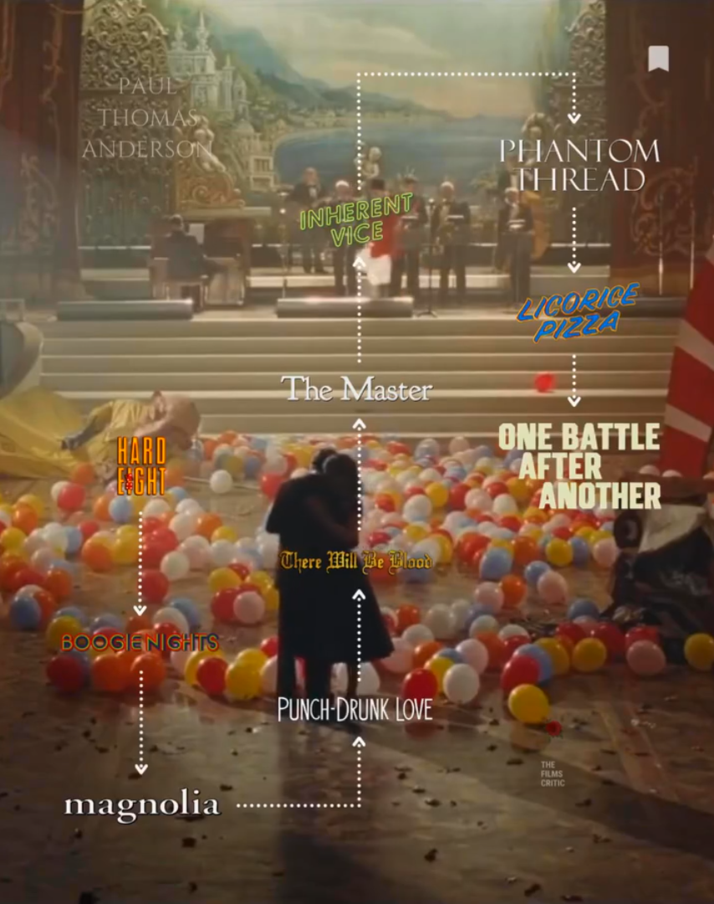

`A retrospective: he is just flexing`

When you ask someone their favorite Paul Thomas Anderson film, you would almost never get the same answer. To the point any title from his filmography could be your favorite. And that's also going to change over time like mine has over the years. One person's PTA is Daniel Day-Lewis screaming, “I have abandoned my boy.” Another would be Adam Sandler running through Hawaii in a blue suit. Someone else sees Dirk Diggler dancing in a porn studio, Philip Seymour Hoffman trying to recruit a damaged young drifter, or Joaquin Phoenix in a groovy 70s Los Angeles neo noir mystery. And now there is Leonardo DiCaprio running around with a terrible gun while trying to protect his daughter.  Yeah, that's PTA!

One of the most prolific American filmmakers of all time, Paul Thomas Anderson is a cult in his name (filmbros love to call him PTA) itself having established himself as an auteur maestro who writes and directs deeply personal narratives. This essay is not an attempt to interpret his work but rather a compilation of my thoughts and insights about his filmography that has continued to impress me over the years. This is about something I find very compelling, not just as a filmmaker: how an artist keeps challenging himself at every turn and how that challenge becomes part of the pleasure of watching his craft.

### Father figure Cinema 
What kind of films does PTA make? About Family and relationships? That does not say anything about him.To categorize his work merely as "studies in human relationships" feels like dismissing Scorsese as just the "gangster guy" or David Lynch as the "weird surrealist director." However to a large extent, ‘Found family’ trope is a common theme seen in many of his works starting from the very beginning - his debut feature *Hard Eight (1996)* where Philip Baker Hall’s elderly Sydney takes a young John C. Reilly as his protege/son in the casino scene of Reno, Nevada. This dynamic grows into full operatic glory in *Boogie Nights (1997)* set in glittery 1970s Los Angeles adult film industry where Mark Wahlberg’s (after which he unfortunately pivoted into mainstream action hero flicks) Dirk Diggler is taken by porn producer Burt Reynolds under his wing among other lost souls. PTA’s protagonists flee their broken biological homes and find their place in the surrogate homes, fringe industries and charismatic leaders. Surrogate family cinema also poignantly done by others like *Hirokazu Kore-eda*, the juxtaposition of horrific parenting with this seemingly tender newfound belonging is sometimes the mere backdrop of a more catastrophic exploitation of power and fragile ego leading to alienation or redemption. Every character in the ensemble melodramatic epic *Magnolia (1999)* goes through the collective cruelty of unresolved trauma, seeking redemption leading to a climax of literal downpour of blown out proportions. One such figure is Frank T.J. Mackey (Tom Cruise in a tour de force performance) who creates a hyper-masculine, misogynistic self-help persona to disguise the deep trauma of being abandoned as a teenager by his dying father, Earl Partridge (Jason Robards) who is taken care of by a deeply moving Philip Seymour Hoffman and a constantly weeping young wife played by the incredible Julianne Moore seeks redemption. 

Paul doesn’t shy away from getting personal with his flawed characters evidently even in the latest *One Battle After Another (2025)* where the central father-daughter dynamic between Leonardo DiCaprio and Chase Infiniti (a revelation performance) was heavily inspired by his own real life daughters. The evolution of this fatherhood dynamic can also be charted in *There Will be Blood (2007)* where the patriarch exploits his adopted son for his early 20th century capitalist ambitions and in *The Master (2012)* that explores the manipulation of a feral traumatized WWII veteran by a charismatic cult leader. The willingness of vulnerability deserves to have an altruistic appeal at least in a grand scheme of things.

### The Art of Reinventing the Craft and Subversion

When asked about his favourite movies, Paul would talk fondly of E.T. or Adam Sandler comedies (one of the reasons he was cast in *Punch-Drunk Love (2002)*) instead of throwing in some Fellini, Godard or obscure European titles. This essence of “coolness” makes his work much more authentic in the most un-diegetic fashion. After the successfully acclaimed films of early career i.e. Magnolia (1999) and Boogie nights (1997) both of which are massive sprawling dramas of roughly 3 hour emotional maximalism, he could have gone down the road of sprawling epics. What does he do? In a seemingly practical joke on expectations, he makes a “small" Adam Sandler romcom just to show off how much he can pull off in 90 minutes. What you get is an absurdist stripped down take on the recognizable late 90s and early 00s romantic flicks into an expression of loneliness, neurodivergent anxiety and love-induced strength. Adam Sandler’s crashout and comedic chops cease to be mere entertainment value. I can talk all day about the other aesthetic aspects of his films like the unconventional score and the color theory visuals. His recent romcom *Licorice Pizza (2021)* seems like a spiritual sequel to *Punch-Drunk Love (2002)* with a flip on the male protagonist while still presenting a similar oddly real depiction of an unusual love story.
There is no illusion in subversion however subtle the piece of art be. Anderson’s postmodern sensibilities do not necessarily emerge from deconstruction of conventional narrative styles or his Pynchon loyalist nature but also largely from the core of the human condition itself. The “mirage” of subtlety should not be simply dismissed as an artistic tool to blend well with other aesthetics of the same medium. Anderson’s foray into the restrained postwar English high society in *Phantom Thread (2017)* was a brief adieu to his Californian comfort. Daniel Day Lewis’ Reynolds Woodcock (Yes another absurd PTA character nomenclature in the similar veins of OBAA’s Perfidia Beverly Hills) moves through immaculate corridors, architecture, breakfasts and most importantly fabrics and the very own dangerous fabric of control dynamic with his muse/partner. Paul really seemed to let silence and texture do the work that shouting and spectacle did in his earlier films with his own cinematography. He is most definitely mature in his craft as an auteur now. And now after the ambitious side-hustling romantic Gary Valentine flirting with an older Alana Haim, PTA returns in an unprecedented form with an action thriller about left wing revolutionaries battling the white supremecists. *One Battle After Another (2025)* seems like another problem to solve for PTA not necessarily in the explicitly political way as the art itself is political expression. He finally grabbed his much deserved Oscars for the same, in a culminating sense of validation from all around the audience and critics alike.
Distinctly American in his idiosyncratic sensibilities, Paul Thomas Anderson’s influences include Robert Altman, also a deeply American filmmaker. Many cinephiles describe *Magnolia (1999)* as “Altman’s *Short Cuts (1993)* directed by Scorsese”, Anderson was a standby or backup director for Altman's final film *A Prairie Home Companion (2006)*. The epic tendency of energetic ensemble maximalism of his early works was not PTA’s own voice to a large extent having been influenced by aforementioned Altman and Scorsese (the flashy one shot opening of *Boogie Nights* in a cinematic dialogue with the one with *Godfellas (1990)* could be the most visible comparison besides the ending similar to *Raging Bull (1980)*). Then his stylistic pivot starting from the early 2000s until now prioritizes intricate frame composition, surreal lighting, and more deliberate pacing over constant camera movement accompanied by Jonny Greenwood’s eerie, avant-garde orchestral scores. This introspective restraint with occasional mixture of varying aesthetics seemingly dictates Andersion’s auteur precision lately. As much as I was awestruck at the flashy self-conscious *Magnolia* or *Boogie Nights* of his early frenzy extravaganza, I am now more deeply captivated by the mature panoramic static shots of Phantom Thread or the Master from his later works. Nevertheless, the consistency in making “great” pieces, each one distinct in its ambition, temperament and cinematic language is one remarkable feat about his career. This refusal to become comfortable with one’s own mastery is more than an astonishing showcase of versatility. For instance, the illusion of depth is not to be confused with the quirky urge of making a massive epic about daily relationship troubles instead of usual war or Roman epics.

` “It is mostly with your blood, Gala, that I paint my pictures.” — Salvador Dalí`

One of the quieter pleasures of Anderson's filmography is watching his creative family evolve alongside his cinematic ambitions. His recurring collaborations with Philip Seymour Hoffman, Philip Baker Hall, John C. Reilly, Daniel Day-Lewis, and, more recently, Joaquin Phoenix and Jonny Greenwood (also his cinematographers past and present) lend his filmography a peculiar sense of continuity, almost as though these actors are returning to different chapters of the same sprawling American novel. Yet Anderson is equally willing to step outside this familiar ensemble and discover something entirely new in performers who might not immediately seem like obvious choices for his cinematic universe. *Adam Sandler* in Punch-Drunk Love, Alana Haim in *Licorice Pizza* (while casting PS Hoffman’s son Cooper in the alongside her has never been more endearing), and *Chase Infiniti* in One Battle After Another are instinctively a wonderful display for recognising a particular screen presence and building an entire character around it beyond the comfort of artistic muses. He allows actors the freedom to inhabit their eccentricities without losing sight of the larger composition, whether that means drawing a career-defining dramatic performance from a comedian like Sandler or allowing an established star like Tom Cruise to disappear into an emotionally uncomfortable character. This sense of professional generosity extends to embracing uncertainty in his storytelling approach. Perhaps the most telling example of this trust in the creative process is *One Battle After Another*, which Anderson reportedly began filming without having the complete plot figured out which is rather an audacious proposition for a filmmaker operating at this scale, but perhaps the clearest testament to his Altman-esque collaborative “character over story” approach to filmmaking.

Talking about endings, what fascinated me with his latest hit OBAA (besides the lustful vistavision film cinematography) is not its political urgency or the exhilarating car chase sequence, but its unexpectedly optimistic conclusion. For a filmmaker whose earlier works often found their characters trapped in cycles of trauma and spiritual emptiness there is something remarkably tender about ending this particular odyssey with an unabashed display of hope for a better tomorrow. The world has not been repaired, the machinery of oppression remains intact, and the revolution is certainly not over. Yet Willa drives forward, carrying none of the weary cynicism that defined her father's generation. The battles continue, but so does the possibility of something beyond them. It is tempting to read this as the late-career metamorphosis of an artist into metamodernism and its extended self reflective tendencies which is quite common like we have observed with Scorsese’s *Irishman (2019)* and *Killers of the Flower Moon (2023)* or Michael Haneke’s swan song, *Happy End (2017)* or even Tarantino’s *Once Upon a Time in Hollywood (2019)* for example. But what’s different about Paul Thomas Anderson’s recent metatextuality is not necessarily concerned with the reflection of his most definitive traits but rather with the inevitable outlook of modern anxiety equipped with a new sincerity aesthetic. Well interestingly PTA has dealt with contemporary era only a few times as in OBAA, Magnolia and Punchdrunk love. One of my criticisms about “great” filmmakers of our generation is their refusal to explore the current digital age we live in, even the contemporary set characters in OBAA are not allowed to use mobiles for the entirety of the film due to the established plot “armour”. Ari Aster’s *Eddington (2025)* is the most exciting example (could be a double feature with OBAA) of inspecting current political scenarios with extensive use of mobile screens set against the deeply polarized Covid Era paranoia. I hugely advocate making pieces like this instead of always having to revisit the cinematic past. 

### LA through a sensual lens
To watch a Paul Thomas Anderson film is to experience Los Angeles not as an industry backdrop or a cynical collection of noir tropes, but as a living, breathing sensory landscape. This intoxicating and almost physical intimacy of the city is a big reason his films lingers in me extremely well. And you could guess easily that he did grow up in the San Fernando Valley with access to filmmaking instruments owing to his proximity to the industry and his father, a Hollywood showbiz figure himself. The sunny Californian landscape became an impressionistic mosaic of heat, asphalt, and lingering light much to the point that *Magnolia* acts as his love letter to the valley he was born and raised. Similarly in *Boogie Nights* and *Licorice Pizza*, his camera glides across the Valley floor with an ecstatic, kinetic freedom—capturing the warm, grainy texture of 35mm stock, the low hum of traffic under streetlights, and the golden dusk filtering through dusty palm fronds.The air in a PTA film feels heavy with moisture, exhaust, petroleum, and unexpressed longing, instilling a deep sense of nostalgia for a time and place I never existed in.

Even when rendering the sterile interiors of Valley warehouses or suburban strip malls as seen in *Punch-Drunk Love*, Anderson infuses the frame with a striking sensory palette: sudden bursts of saturated light, the fluorescent glare of late-night convenience stores, or the disorienting, rhythmic drone of a carpet warehouse that mirrors a protagonist's internal panic. In *One Battle After Another*, the golden highways and sun-bleached coastal stretches pulse with a rich, tactile warmth, proving that Anderson's eye for location remains unmatched. Or could one forget the psychedelic drug infused photograph of the valley in the hazy *Inherent Vice (2014)*. Through his lens, Los Angeles ceases to be a mere setting; it becomes a romantic, volatile partner in the drama. It is a terrain of endless asphalt and open horizons—a place where broken people run, collide, reinvent themselves, and occasionally, against all odds, manage to find a way back home.
